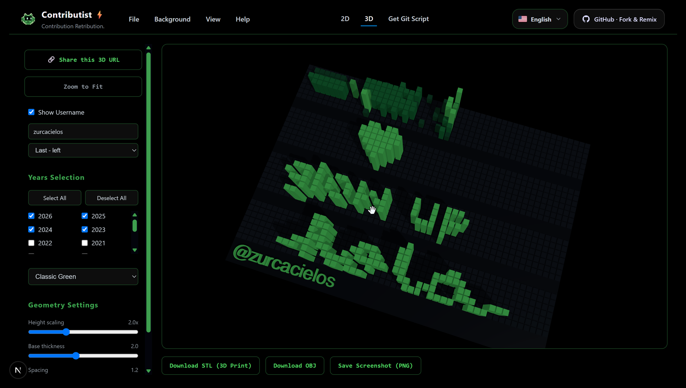
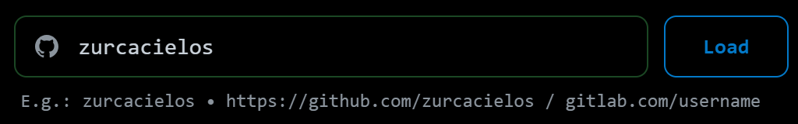

### Contributist — Git Contribution Graph Painter

**Contributist** is an interactive web tool to paint custom pixel art directly onto your Git contribution graph. Design your layout, load templates, and generate a commit history script to customize your profile instantly.

## Live Demo --> [**contributist.stupidity.works**](https://contributist.stupidity.works)


## Install it locally - Prerequisites -running

- **Node.js** (v18 or higher recommended)
- **npm** or **yarn** / **pnpm**

   ```bash
   git clone git@github.com:zurcacielos/contributist.git
   cd contributist
   ```

   ```bash
   npm install
   ```

   ```bash
   npm run dev
   ```


### Main Dashboard
<p align="center">
  
</p>

*Customize your contribution grid using the drawing board, colors, and layers.*

### 3D - Trophy Mode
<p align="center">
  
</p>

*Download the 3D assets of your 3D scene from the 3D tab for use in Blender and other 3D software, or to Print your contributions chart in 3D, at a local 3D printing shop.*

### Import Github/GitLab/Gitea Contributions
<p align="center">
  
</p>

*Import your contributions from Github/GitLab/Gitea to your contributist, and start painting your contributions.*

### Layer editing - raster - background - sprites
<p align="center">
  
</p>

*Layer editing features allow you to add custom shapes, sprites, and background images to your contribution graph. Change order, hide during editing, add text, and more to come!*

### Memes and Text toolbar for quick fun
<p align="center">
  
</p>

*The memes and text toolbar, appears in the Selected Year, and allows you to add memes and text to your contribution graph.*

### Send to git dev mode and cloud mode
<p align="center">
  
</p>

*The send to git feature, has two modes. Local mode, when you do a npn run dev in your local machine, which allows you to generate and send your contributions directly to your git repository without running any local scripts. Cloud mode, when the application is deployed online, it allows you to download the Bash script or Powershell scripts to run the commits yourself on your own machine.*

### PNG export mode green, blue, vibe
<p align="center">
  
</p>

*The png export mode allows you to download a png image of your contribution graph, with different color palettes. This is useful for sharing your artwork on social media or other platforms.*

### URL Export
<p align="center">
  
</p>

*The url export mode allows you to generate a url that can be used to share your artwork with others. Just share the url in the Share screen, and the entire configuration will be encoded for you in that url, so the other person sees your art immediately.*

### File Menu - New, Open, Save
<p align="center">
  
</p>

*In the File menu, the New option allows you to create a new artwork. The Open option allows you to open an existing artwork. The Save option allows you to save your artwork to your computer. Including the github user and repo name that you may have entered in the Send to git section.*

---

## ✨ Features

- **Interactive Canvas:** Draw on the contribution grid with direct paint and eraser tools.
- **Multiple Feeling Modes:**
  - **Vibe Mode:** Focused purely on creative pixel-art painting.
  - **Advanced Mode:** Allows fine-grained control over noise, weekends, vacation patterns, and commit densities.
- **Layer Engine:** Manage multiple layers including custom raster layers, memes, and background configurations. Tweak opacity, visibility, and locking settings.
- **Local Git Generation:** Option to run local script endpoints to commit and push your drawings directly to your GitHub history.
- **Community presets:** Load and remix existing scenes (like a running cat, pixel hearts, and more).

---


## ⚙️ Environment Variables Configuration

The project configures its default settings through the `.env` file, which is tracked by Git. For local overrides or private repository configuration, you can create a `.env.local` file.

See the [Environment Variables Guide](environment-vars.md) for the list of available configuration variables and setup examples.

---

## 🧪 Testing

To run the unit and integration tests using Vitest:

```bash
# Run tests interactively
npm run test

# Run tests once (CI mode)
npm run test:run
```

---

## 🛡️ License

This project is licensed under the MIT License - see the [LICENSE](LICENSE) file for details.
